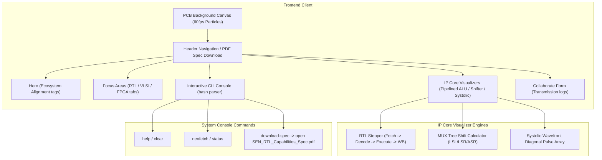

# SEN.RTL — Engineering the Future of Silicon

<div align="center">

[](https://github.com/sen-rtl)
[](https://vercel.com)
[](LICENSE)
[](#-engineering-domains)

</div>

---

## 📌 Project Overview

**SEN.RTL** is an ultra-premium, interactive semiconductor engineering portfolio and digital design studio. It serves as a visual showcase of high-performance Register-Transfer Level (RTL) cores, FPGA prototyping platforms, and ASIC timing closure methodologies.

Unlike generic portfolios, **SEN.RTL** features **live hardware simulators** built natively in web standards, demonstrating functional pipeline execution, arithmetic MUX trees, and systolic matrix operations directly in the browser.

---

## 🛠️ Engineering Domains Covered

*   **RTL Design & Verification**: Designing modular, parameterized, synthesizable IP blocks in Verilog/SystemVerilog with strict control/datapath separation.
*   **FPGA Prototyping**: Mapping logical constructs to hardware primitives (slices, LUTs, block RAMs, DSP cores) on Xilinx Artix-7 fabric.
*   **ASIC Design Flow**: Synthesis constraints, logical-to-physical optimization, floorplanning, CTS, and routing layout criteria.
*   **Static Timing Analysis (STA)**: Setup/hold constraints, path delay margins, multi-corner timing checks, and timing closure workflows.
*   **Digital Architecture**: RV32I RISC-V pipelines, hazards resolution (stalls & forwarding), and parallel systolic arrays.
*   **Hardware Verification**: Self-checking testbench architectures, directed vectors, and waveform debugging.

---

## ⚡ Core Interactive Simulators

The portfolio hosts three interactive digital hardware visualizers that let recruiters step through clock cycles:

### 1. RISC-V RV32I Pipelined ALU
*   **Pipeline Stages**: Visualizes Fetch (IF), Decode (ID), Execute (EX), and Writeback (WB).
*   **Hazard Handling**: Detects Read-After-Write (RAW) data hazards and highlights active data-forwarding paths or bubble insertion stalls.
*   **Physical Verification**: Includes tabs for the **Synthesized RTL Schematic** and **ModelSim Simulation Waveforms** reports.

### 2. Parameterized N-Bit Barrel Shifter
*   **MUX Tree Architecture**: Implements $log_2 N$ levels of cascaded 2-to-1 multiplexers for single-cycle operations.
*   **Modes**: Dynamic arithmetic right shift (ASR), logical right shift (LSR), and logical left shift (LSL) reacting to input sliders and binary input buffers.
*   **Signal Output**: Explains the active multiplexer select line ($S_2, S_1, S_0$) states and tracks sign retention.

### 3. Systolic Matrix Multiplier Array
*   **Parallel Acceleration**: A 4x4 spatial processing element (PE) array executing Multiply-Accumulate (MAC) operations.
*   **Wavefront Feeding**: Steps diagonal wavefront pulses showing localized data propagation to reduce SRAM memory bandwidth demands.

---

## 💻 Tech Stack & Performance

Designed with ECE metrics in mind—focusing on speed, efficiency, and zero runtime bundle overhead.

| Technology | Role | Advantage |
| :--- | :--- | :--- |
| **HTML5 & Vanilla JS** | Core UI & Simulator Engines | Zero bundle overhead, instant script execution |
| **CSS3 Custom Variables** | PCB Obsidian Grid Theme | Modern glassmorphic backdrops, glowing active signal traces |
| **Canvas API** | Dynamic Background Tracks | 60fps background particle animation simulating clock line noise |
| **Lucide Icons** | Visual Iconography | Lightweight vector iconography |
| **Vercel** | Platform Hosting | Global CDN, automated git integration builds |

---

## 📊 System Architecture Flow

The following Mermaid diagram visualizes the interactive design hierarchy of the portfolio platform:



---

## 🛠️ Quick Start & Local Hosting

To run the design studio locally on your workstation, follow these simple steps (no NPM/Node package installation overhead is required):

1.  **Clone the Repository**:
    ```bash
    git clone https://github.com/GsrBhat/sen-rtl-portfolio.git
    cd sen-rtl-portfolio
    ```

2.  **Launch Local Server**:
    Using Python's built-in server:
    ```bash
    python -m http.server 8000
    ```
    *Or use the Live Server extension in VS Code.*

3.  **Access the Port**:
    Open your web browser and navigate to:
    ```text
    http://localhost:8000
    ```

---

## 🚀 Future Roadmap

- [ ] Add a **4-bit Carry-Lookahead Adder (CLA)** gate-level interactive logic simulator.
- [ ] Implement a **FIFO circular buffer** write/read controller visualizer with empty/full status flags.
- [ ] Add **WaveDrom** integration inside the project cards to render clock waveforms dynamically from JSON test vectors.
- [ ] Extend the console command parser to support custom scripting macros.

---

## 🤝 Collaborate with SEN.RTL

For contract R&D, digital design consulting, RTL IP licensing, or custom semiconductor acceleration architectures:

*   **Design Channel Email**: [design@sen-rtl.com](mailto:design@sen-rtl.com)
*   **GitHub Organization**: [github.com/sen-rtl](https://github.com/sen-rtl)
*   **Engineering Directory**: [linkedin.com/in/sairahulbhatg](https://linkedin.com/in/sairahulbhatg)
